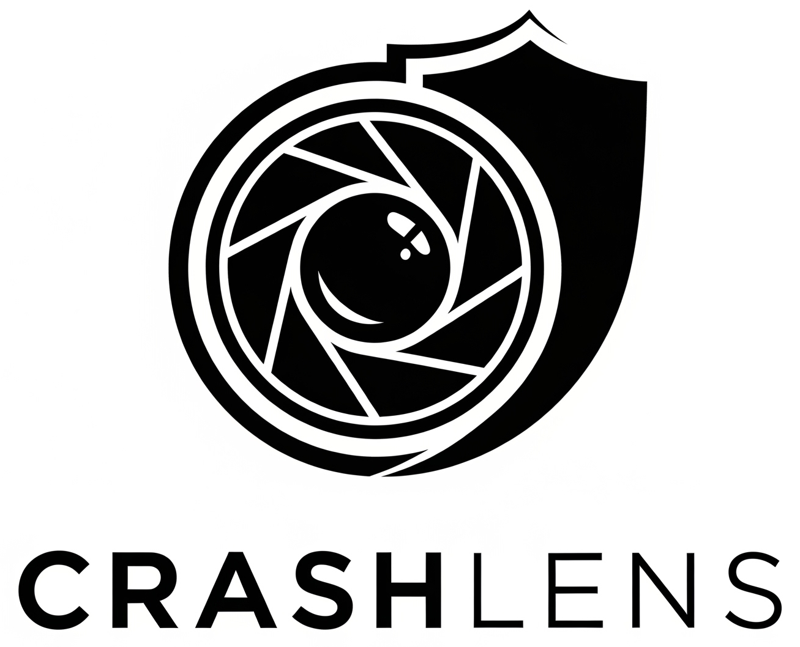

# CrashLens — Programmable firewall for LLM APIs

**CrashLens** is a CLI-first FinOps tool that detects token waste, retry storms and model overuse from LLM logs and fails CI on high-cost patterns.  
**One-liner:** Enforce token, retry and model policies in CI and runtime analysis. (PoC: 18–35% token/cost reduction; see `/docs/bench/results.md`.)

  [](docs/demo.mp4)

## Quickstart (30s)
```bash
pip install crashlens
crashlens init
crashlens scan --demo            # runs example logs and writes report.md
```

Expected output (short):

```
❌ retry_storm_detected (12 > max_retries=3)
Summary: 3 violations, potential savings: 18-35%
Exit code: 1
```

## Architecture

Mermaid diagram (also available as `docs/architecture.png`)

```mermaid
graph LR
	A[App] --> B(CrashLens)
	B --> C{Policy Engine}
	C -->|pass| D[LLM API]
	C -->|block| E[Policy Block (exit 1)]
	B --> F[Prometheus Pushgateway]
```

Core features: Runtime enforcement · CI guardrails (fail-on-violation) · Prometheus metrics & Grafana.
Full docs, policy language, dashboards, and benchmark scripts → `docs/`

