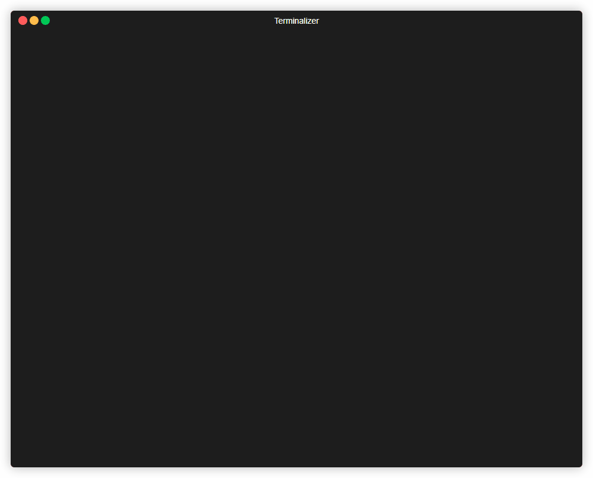
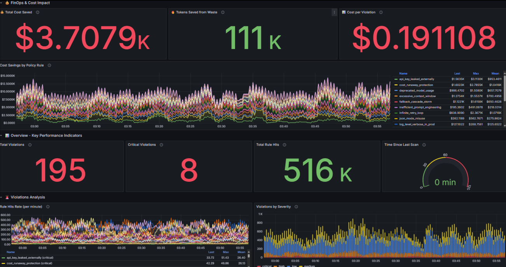
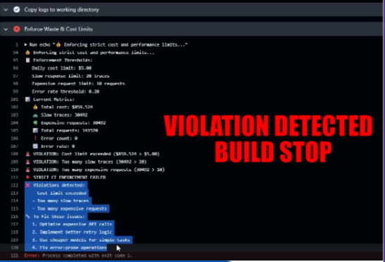
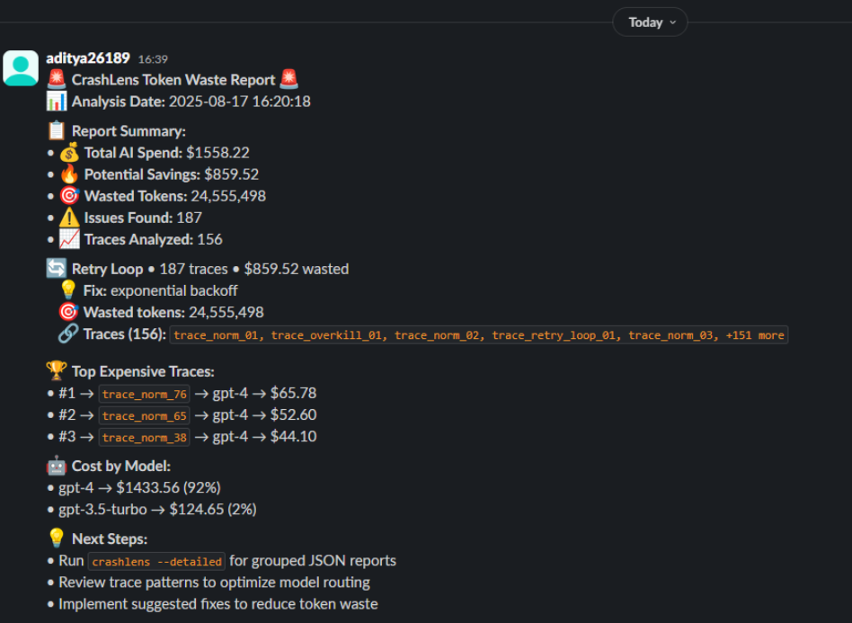

# 🧠 CrashLens: AI Token Waste Detective

<div align="center">

[](https://pypi.org/project/crashlens/)
[](https://python.org)
[](LICENSE)
[]()

**The Ultimate AI Cost Optimization Tool**

*Detect hidden token waste • Prevent budget overruns • Optimize LLM usage*

  

<video src="demo%20video/Video%20Project.mp4" controls width="600"></video>

🎬 **Full demo video:** [📁 Open demo video folder](demo%20video/)

**Core features:** Runtime enforcement · CI guardrails (fail-on-violation) · Prometheus metrics & Grafana

[Quick Start](#-quick-start) • [Features](#-features) • [Documentation](#-documentation) • [Examples](#-examples)

</div>

---

## 🎯 What is CrashLens?

CrashLens is a **developer-first CLI tool** that analyzes your AI API logs to uncover **hidden token waste**, retry loops, model overkill, and inefficient patterns. It helps you **optimize OpenAI, Anthropic, and Langfuse usage** by providing actionable cost-saving insights.

### 🔍 **Why CrashLens?**

> *"You can't optimize what you can't see."*

- **💰 Cost Savings**: Identify 40-60% potential savings in AI spending
- **🔒 Privacy First**: 100% local analysis, no data leaves your machine  
- **⚡ Production Ready**: Battle-tested policy engine with CI/CD integration
- **🎯 Actionable**: Specific recommendations, not just analytics

---

## 🚀 Quick Start

### Prerequisites
- **Python 3.12+** ([Download here](https://python.org/downloads/))
- AI usage logs in JSONL format (OpenAI, Anthropic, Langfuse)

### Installation & Setup

```bash
# Install CrashLens
pip install crashlens

# Interactive setup wizard
crashlens init

# Quick scan with demo data
crashlens scan --demo

# Analyze your logs
crashlens scan your-logs.jsonl

# Optional: Set up Slack notifications
export CRASHLENS_SLACK_WEBHOOK="your-webhook-url"
crashlens scan your-logs.jsonl  # Auto-posts to Slack
```

### Non-Interactive Setup (CI/CD)

**macOS/Linux:**
```bash
export CRASHLENS_TEMPLATES="all"
export CRASHLENS_SEVERITY="medium"
crashlens init --non-interactive
```

**Windows (PowerShell):**
```powershell
$env:CRASHLENS_TEMPLATES = "all"
$env:CRASHLENS_SEVERITY = "medium"
crashlens init --non-interactive
```

---

## � Core Features

### 🕵️ **Waste Detection Engine**
- **🔄 Retry Loop Detection**: Exponential backoff failures, redundant retries
- **❓ Model Overkill**: GPT-4 used for simple 3-token completions  
- **📢 Fallback Storms**: Cascading model failures wasting tokens
- **⚡ Prompt Inefficiency**: Long prompts generating tiny responses
- **💸 Budget Violations**: Expensive calls exceeding thresholds

### 🛡️ **Policy Enforcement**
- **Production-Grade Rules**: 10+ built-in policy templates
- **Custom Policies**: YAML-based rule definitions
- **CI/CD Integration**: Fail builds on policy violations
- **Severity Levels**: Critical, High, Medium, Low classifications
- **Smart Suppression**: Prevents alert fatigue

### 📊 **Analysis & Reporting**
- **Multi-Format Reports**: Markdown, JSON, Slack-ready notifications
- **🆕 Structured JSON Output**: Frontend-optimized JSON with 9 comprehensive sections
- **Schema Validation**: JSON Schema Draft 7 compliant with CLI validator
- **Auto Slack Integration**: Real-time team notifications with webhook setup
- **Cost Breakdown**: Per-model, per-trace, per-pattern analysis
- **Token Accounting**: Detailed waste calculations
- **Trend Analysis**: Historical cost patterns with timeline visualization
- **ROI Calculator**: Quantified savings recommendations

### 🔒 **PII Removal & Data Sanitization**
- **🧹 PII Detection**: Automatically detects emails, phones, SSNs, credit cards, IPs, API keys
- **GDPR/HIPAA Compliance**: Sanitize logs before cloud upload or sharing
- **Selective Removal**: Choose specific PII types to remove
- **Dry-Run Analysis**: Preview what PII exists without modification
- **Safe Cloud Upload**: Clean logs for Langfuse/Helicone dashboards

### 📊 **Observability & Monitoring** (NEW)
- **Prometheus Metrics**: 7 production metrics for monitoring policy enforcement
- **Probabilistic Sampling**: 10% sampling keeps overhead at 4.04% (Linux validated)
- **Grafana Dashboard**: 15-panel dashboard with 5 alert rules
- **Real-time Alerting**: Violation rate, quality degradation, availability monitoring
- **Zero Overhead Option**: Completely disable metrics when not needed
- **CI/CD Integration**: GitHub Actions workflow for automated benchmarking

---

## 💻 Commands Overview

### 🔍 **Scan & Analyze**
```bash
# Basic scan with smart reporting
crashlens scan logs.jsonl

# Generate detailed JSON reports
crashlens scan logs.jsonl --detailed

# Demo mode with sample data
crashlens scan --demo

# Custom output formats
crashlens scan logs.jsonl --format slack      # Slack-ready format
crashlens scan logs.jsonl --format markdown   # Markdown format
crashlens scan logs.jsonl --format json       # Structured JSON (report_format_json.json)

# Auto-post to Slack (requires CRASHLENS_SLACK_WEBHOOK env var)
export CRASHLENS_SLACK_WEBHOOK="your-webhook-url"
crashlens scan logs.jsonl                     # Auto-sends to Slack when configured
```

### 🆕 **JSON Format Output**
```bash
# Generate structured JSON report (ideal for dashboards & automation)
crashlens scan logs.jsonl --format json

# Output: report_format_json.json in the same directory as input log file
# Contains 9 sections: metadata, summary, issues, traces, models, 
#                      timeline, recommendations, alerts, export_options

# Validate JSON output against schema
python -m crashlens.formatters.schema_validator report_format_json.json

# Use with different input sources
crashlens scan --demo --format json           # Demo data → examples-logs/report_format_json.json
cat logs.jsonl | crashlens scan --stdin -f json  # stdin → ./report_format_json.json
```

**JSON Output Structure:**
- **metadata**: Scan info, version, timestamps
- **summary**: Totals, costs, savings, key metrics
- **issues**: All detected issues with severity & suggestions
- **traces**: Detailed trace analysis with costs
- **models**: Per-model cost breakdown & statistics
- **timeline**: Chronological events for visualization
- **recommendations**: Prioritized optimization actions
- **alerts**: Critical warnings & thresholds
- **export_options**: Data export capabilities
```

### 🛡️ **Schema Contract Validation** (NEW)
```bash
# Validate logs against schema contract
crashlens scan --contract-check logs.jsonl --log-format langfuse-v1

# View schema requirements
crashlens scan --contract-info --log-format langfuse-v1

# Validate multiple files (Unix/Linux/macOS)
find . -name "*.jsonl" -exec crashlens scan --contract-check {} --log-format langfuse-v1 \;

# Validate multiple files (Windows PowerShell)
Get-ChildItem -Recurse -Filter *.jsonl | ForEach-Object { crashlens scan --contract-check $_.FullName --log-format langfuse-v1 }
```

**Benefits:**
- ✅ Block malformed logs in CI/CD pipelines
- ✅ Ensure data quality before production
- ✅ Catch missing required fields early
- ✅ Validate against versioned schema contracts

### 🧹 **PII Removal** (NEW)
```bash
# Remove all PII types from logs
crashlens pii-remove logs/production.jsonl

# Preview PII without modifying files
crashlens pii-remove logs/app.jsonl --dry-run --verbose

# Remove specific PII types only
crashlens pii-remove logs/app.jsonl --types email --types phone_us

# Custom output location
crashlens pii-remove logs/app.jsonl --output clean/sanitized.jsonl

# List available PII types
crashlens pii-remove --list-types
```

**Supported PII Types:**
- `email` - Email addresses
- `phone_us` - US phone numbers
- `ssn` - Social Security Numbers
- `credit_card` - Credit card numbers
- `ip_address` - IPv4 addresses
- `api_key` - API keys/tokens (32+ chars)
- `street_address` - Street addresses
- `date` - Date formats

**Workflow Example:**
```bash
# 1. Remove PII from production logs
crashlens pii-remove logs/production.jsonl --output logs/clean.jsonl

# 2. Scan sanitized logs
crashlens scan logs/clean.jsonl --format markdown

# 3. Safe to upload to cloud dashboard
# Upload clean.jsonl to Langfuse/Helicone
```

### 🛡️ **Policy Enforcement**
```bash
# Check logs against all policies (generates report.md)
crashlens guard logs.jsonl --rules policies/rules.yaml

# Generate detailed JSON report for CI/CD integration
crashlens guard logs.jsonl --rules policies/rules.yaml --output json

# Custom output paths and quiet mode
crashlens guard cold-dev-test.jsonl --rules my-policy.yaml --severity-threshold high

# Use specific policy templates
crashlens guard logs.jsonl --rules policies/retry-loop-detector.yaml

# Custom policy file
crashlens guard logs.jsonl --rules my-policy.yaml

# Fail on violations (CI/CD mode)
crashlens guard logs.jsonl --rules policies/rules.yaml --fail-on-violations

# Privacy-safe reports (strip PII, exclude content)
crashlens guard logs.jsonl --rules policies/rules.yaml --strip-pii --no-content
```

> **Note:** The `guard` command is maintained as a backwards-compatible alias for `guard`.

**📁 Output Organization:**
Policy violation reports are automatically organized in the `policy-violations/` folder:
- `policy-violations/reports/` - Concise Markdown summaries
- `policy-violations/traces/` - Detailed JSON analysis files
- See `policy-violations/README.md` for complete documentation

### 🛠️ **Management & Simulation**

**Cross-platform:**
```bash
# List available policy templates
crashlens list-policy-templates

# Simulate different usage patterns
crashlens simulate --output test.jsonl --count 500 --scenario retry-loop

# Setup project with policies
crashlens init
```

---

## � Observability

CrashLens supports Prometheus metrics for monitoring policy enforcement in production.

### Quick Start

**Option 1: Push Mode (for ephemeral processes like CI/CD)**
```bash
# Install with metrics support
pip install crashlens[metrics]

# Start pushgateway
docker run -d -p 9091:9091 prom/pushgateway

# Run with metrics push
crashlens scan logs.jsonl --push-metrics

# View metrics
curl http://localhost:9091/metrics | grep crashlens
```

**Option 2: HTTP Server Mode (for long-running processes)**
```bash
# Enable HTTP server mode (requires explicit opt-in)
export CRASHLENS_ALLOW_HTTP_METRICS=true

# Run with HTTP server
crashlens scan logs.jsonl --metrics-http --metrics-port 9090

# Prometheus scrapes from http://localhost:9090/metrics
```

**When to use each mode:**
- **Push Mode**: CI/CD pipelines, Lambda functions, short-lived jobs
- **HTTP Mode**: Kubernetes pods, long-running servers, persistent processes

### Available Metrics

- **`crashlens_rule_hits_total{rule,severity,mode}`** - Policy rule triggers
- **`crashlens_violations_total{severity}`** - Total violations by severity
- **`crashlens_traces_processed_total`** - Successfully processed traces
- **`crashlens_traces_failed_total{reason}`** - Failed trace processing
- **`crashlens_decision_latency_avg_seconds{rule}`** - Average rule evaluation time
- **`crashlens_decision_latency_max_seconds{rule}`** - Maximum rule evaluation time (outliers)
- **`crashlens_last_run_timestamp_seconds{status}`** - Last scan completion time
- **`crashlens_metrics_push_status`** - Metrics push success indicator

### Configuration

**Push Mode (via CLI flags):**
```bash
crashlens scan logs.jsonl \
  --push-metrics \
  --pushgateway-url http://prometheus:9091 \
  --metrics-job my-app-guard
```

**HTTP Server Mode (via CLI flags):**
```bash
# Requires: export CRASHLENS_ALLOW_HTTP_METRICS=true
crashlens scan logs.jsonl \
  --metrics-http \
  --metrics-port 9090 \
  --metrics-addr 127.0.0.1
```

**Via environment variables:**
```bash
# Push mode
export CRASHLENS_PUSH_METRICS=true
export CRASHLENS_PUSHGATEWAY_URL=http://prometheus:9091

# HTTP mode
export CRASHLENS_ALLOW_HTTP_METRICS=true

crashlens scan logs.jsonl
```

**Security Note:** HTTP server mode requires explicit opt-in (`CRASHLENS_ALLOW_HTTP_METRICS=true`) and defaults to localhost-only binding. See [docs/HTTP_SERVER_SECURITY.md](docs/HTTP_SERVER_SECURITY.md) for security best practices.

### Grafana Dashboard



Import the pre-built dashboard from `dashboards/crashlens-policy-enforcement.json`.

See full documentation in [docs/OBSERVABILITY.md](docs/OBSERVABILITY.md).

---

## �📈 Example Report Output

### 🚨 **Cost Analysis Report**
```markdown
🚨 CrashLens Token Waste Report 🚨
📊 Analysis Date: 2025-08-17

📋 Report Summary:
• 💰 Total AI Spend: $859.52
• 🔥 Potential Savings: $859.52 (100%)
• 🎯 Wasted Tokens: 38,213,010
• ⚠️ Issues Found: 53,185
• 📈 Traces Analyzed: 156

🔄 Retry Loop • 187 traces • $859.52 wasted
   💡 Fix: exponential backoff
   🎯 Wasted tokens: 24,555,498
   🔗 Traces: trace_retry_loop_01, trace_retry_loop_02, +185 more

❓ Overkill Model • 52,998 traces • $560.24 wasted
   💡 Fix: optimize usage
   🎯 Wasted tokens: 13,657,512
   🔗 Traces: trace_overkill_01, trace_overkill_02, +52,996 more

🏆 Top Expensive Traces:
• #1 → trace_norm_76 → gpt-4 → $65.78
• #2 → trace_norm_65 → gpt-4 → $52.60
• #3 → trace_norm_38 → gpt-4 → $44.10

🤖 Cost by Model:
• gpt-4 → $845.65 (98%)
• gpt-3.5-turbo → $13.87 (2%)
```

### 🛡️ **Policy Violations Report**
```markdown
⚠️ Found 431,970 policy violations:

🚨 CRITICAL SEVERITY (6,534 violations):
  1. high_cost_per_token (line 62437)
     Reason: cost=0.06075 (rule: >0.05)
     Action: fail
     Suggestion: Very expensive API call detected (over $0.05).
     Immediate actions:
     - Review if this cost is justified
     - Check for prompt optimization opportunities
     - Consider model downgrading

⚠️ HIGH SEVERITY (227,238 violations):
  1. gpt4_for_simple_tasks (line 727)
     Reason: model=gpt-4 AND prompt_tokens=5 (rule: <50)
     Action: fail
     Suggestion: GPT-4 used for simple task.
     Cost optimization opportunities:
     - Use gpt-4o-mini (90% cheaper, similar quality)
     - Use gpt-3.5-turbo for classification <500 tokens
     - Reserve GPT-4 for complex reasoning tasks
```

### 🆕 **JSON Format Output** (NEW)
```json
{
  "metadata": {
    "scan_time": "2025-10-11T14:30:00Z",
    "crashlens_version": "2.9.12",
    "schema_version": "1.0.0",
    "log_file": "sample-logs/demo-logs.jsonl",
    "total_traces": 156
  },
  "summary": {
    "total_cost": 859.52,
    "total_issues": 53185,
    "potential_savings": 859.52,
    "savings_percentage": 100.0,
    "wasted_tokens": 38213010,
    "issues_by_severity": {
      "critical": 125,
      "high": 1200,
      "medium": 45000,
      "low": 6860
    }
  },
  "issues": [
    {
      "category": "retry_loop",
      "severity": "high",
      "count": 187,
      "cost": 859.52,
      "wasted_tokens": 24555498,
      "suggestion": "Implement exponential backoff with jitter",
      "fix_priority": 1
    }
  ],
  "recommendations": [
    {
      "priority": 1,
      "title": "Implement Exponential Backoff",
      "potential_savings": 859.52,
      "implementation_effort": "medium",
      "impact": "high"
    }
  ]
}
```

**Benefits:** Frontend-ready, machine-readable, schema-validated, perfect for dashboards and automation. 
See **[NEW_FEATURES.md](NEW_FEATURES.md)** for complete JSON structure documentation.

---

## 🏗️ Policy Templates

CrashLens includes production-ready policy templates:

| Template | Purpose | Estimated Savings |
|----------|---------|-------------------|
| `model-overkill-detection` | Prevent expensive models for simple tasks | 30-50% |
| `retry-loop-prevention` | Block inefficient retry patterns | 20-40% |
| `prompt-optimization` | Optimize prompt efficiency | 15-30% |
| `budget-protection` | Enforce spending limits | Varies |
| `fallback-storm-detection` | Prevent cascading failures | 10-35% |
| `context-window-optimization` | Efficient context usage | 10-25% |
| `production-ready` | Combined rules for production | 40-60% |

### Custom Policy Example
```yaml
# my-policy.yaml
metadata:
  name: "Custom Cost Control"
  description: "Strict cost controls for production"
  
rules:
  - id: expensive_single_call
    description: "Block very expensive calls"
    match:
      cost: ">0.10"
    action: fail
    severity: critical
    suggestion: |
      Call exceeds $0.10 threshold.
      - Review prompt optimization
      - Consider model downgrading
      - Break into smaller requests
```

---

## 🔧 Advanced Usage

### CI/CD Integration

#### GitHub Actions
```yaml
name: AI Cost Control
on: [push, pull_request]

jobs:
  cost-check:
    runs-on: ubuntu-latest
    steps:
      - uses: actions/checkout@v3
      - uses: actions/setup-python@v4
        with:
          python-version: '3.12'
      
      - name: Install CrashLens
        run: pip install crashlens
      
      - name: Policy Check
        run: |
          crashlens guard logs/*.jsonl \
            --rules policies/rules.yaml \
            --fail-on-violations
```

#### Docker Integration
```dockerfile
FROM python:3.12-slim

RUN pip install crashlens

WORKDIR /app
COPY logs/ ./logs/

CMD ["crashlens", "guard", "logs/*.jsonl", "--rules", "policies/rules.yaml"]
```

### CI/CD + Slack Alerts




### Programmatic Usage
```python
from crashlens.policy.engine import PolicyEngine
from crashlens.parsers.langfuse import LangfuseParser

# Load and analyze logs
parser = LangfuseParser()
traces_by_id = parser.parse_file("cold-dev-test.jsonl")

# Flatten all records into a list
traces = [record for records in traces_by_id.values() for record in records]

# Apply policies
engine = PolicyEngine(r"policies\langfuse\ci-sample.yaml")
violations, skipped = engine.evaluate_logs(traces)

print(f"Found {len(violations)} violations")
```

---

## 📁 Supported Log Formats

### OpenAI API Logs
```jsonl
{"model": "gpt-4", "usage": {"prompt_tokens": 10, "completion_tokens": 5}, "cost": 0.0003}
```

### Langfuse Logs
```jsonl
{"input": {"model": "gpt-4"}, "usage": {"promptTokens": 10, "completionTokens": 5}, "calculatedTotalCost": 0.0003}
```

### Anthropic Logs
```jsonl
{"model": "claude-3-opus", "usage": {"input_tokens": 10, "output_tokens": 5}, "cost": 0.0003}
```

---

## 🛠️ Configuration

### Environment Variables

**macOS/Linux:**
```bash
export CRASHLENS_TEMPLATES="all"           # Default policy templates
export CRASHLENS_SEVERITY="medium"         # Minimum severity level
export CRASHLENS_OUTPUT_FORMAT="slack"     # Report format (slack/markdown/json)
export CRASHLENS_SLACK_WEBHOOK="https://hooks.slack.com/services/YOUR/WEBHOOK/URL"
```

**Windows (PowerShell):**
```powershell
$env:CRASHLENS_TEMPLATES = "all"           # Default policy templates
$env:CRASHLENS_SEVERITY = "medium"         # Minimum severity level
$env:CRASHLENS_OUTPUT_FORMAT = "slack"     # Report format (slack/markdown/json)
$env:CRASHLENS_SLACK_WEBHOOK = "https://hooks.slack.com/services/YOUR/WEBHOOK/URL"
```

### Config File (`.crashlens.yaml`)
```yaml
default_templates: ["model-overkill-detection", "retry-loop-prevention"]
severity_threshold: "medium"
output_format: "slack"  # Auto-formats for Slack when webhook is configured
fail_on_violations: true
slack_webhook_url: "https://hooks.slack.com/services/YOUR/WEBHOOK/URL"
```

---

## 🔔 Slack Webhook Integration

CrashLens supports **automatic Slack notifications** for team collaboration and alerting. Get instant notifications when policy violations are detected or cost thresholds are exceeded.

### 🚀 Quick Setup

#### 1. **Get Your Slack Webhook URL**
1. Go to [Slack Apps](https://api.slack.com/apps) → **Create New App**
2. Choose **From scratch** → Name your app → Select workspace
3. Go to **Incoming Webhooks** → Toggle **On** → **Add New Webhook to Workspace**
4. Select your channel → **Allow** → Copy the webhook URL

#### 2. **Configure CrashLens**

**Environment Variable (Recommended):**
```bash
# macOS/Linux
export CRASHLENS_SLACK_WEBHOOK="https://hooks.slack.com/services/YOUR/WEBHOOK/URL"

# Windows PowerShell
$env:CRASHLENS_SLACK_WEBHOOK = "https://hooks.slack.com/services/YOUR/WEBHOOK/URL"
```

**Config File (`.crashlens.yaml`):**
```yaml
slack_webhook_url: "https://hooks.slack.com/services/YOUR/WEBHOOK/URL"
output_format: "slack"  # Auto-format for Slack
```

#### 3. **Test Integration**
```bash
# Scan and auto-send to Slack
crashlens scan logs.jsonl --format slack

# CI/CD integration (uses env variable)
crashlens scan logs.jsonl  # Automatically posts if webhook configured
```

### 📋 **What Gets Sent**
- 🚨 **Policy violations** with severity levels
- 💰 **Cost analysis** and potential savings
- 📊 **Key metrics** (spend, tokens, traces)
- 🔗 **Direct links** to detailed reports
- 🎯 **Actionable recommendations**

### 🔧 **Advanced Setup**
For CI/CD pipelines, GitHub Actions integration, and custom notification formats, see the complete [Slack Integration Guide](docs/SLACK_INTEGRATION.md).

---

## 🎯 Use Cases

### 🏢 **Enterprise**
- **Cost Center Analysis**: Track AI spending by team/project
- **Compliance Auditing**: Policy enforcement across organizations
- **Budget Controls**: Prevent runaway AI costs
- **Performance Optimization**: Identify inefficient patterns

### 👨‍💻 **Development Teams**
- **Debug LLM Integrations**: Find retry loops and fallback issues
- **Code Review**: Automated cost analysis in PRs
- **Local Testing**: Analyze logs during development
- **Performance Tuning**: Optimize prompt efficiency

### 🔬 **Research & Analysis**
- **Token Usage Studies**: Understand consumption patterns
- **Model Comparison**: Cost/performance analysis
- **Efficiency Research**: LLM optimization studies
- **Trend Analysis**: Historical usage patterns

---

## 🆕 What's New

Check out **[NEW_FEATURES.md](NEW_FEATURES.md)** for detailed documentation on the latest updates:

- 🎯 **Structured JSON Output**: Frontend-optimized format with 9 comprehensive sections
- 📊 **Schema Validation**: JSON Schema Draft 7 compliant with CLI validator
- �️ **Contract Validation**: Validate logs against Langfuse schema contracts in CI/CD
- �🔄 **Smart Output Locations**: Reports saved alongside input files
- 📈 **Timeline Visualization**: Chronological event data for charts
- 🤖 **Per-Model Analytics**: Detailed cost attribution and optimization potential

**Quick Examples:**
```bash
# Generate JSON report
crashlens scan logs.jsonl --format json

# Validate schema contract
crashlens scan --contract-check logs.jsonl --log-format langfuse-v1

# View schema requirements
crashlens scan --contract-info --log-format langfuse-v1
```

---

## 📚 Documentation

### 📖 Getting Started
- **[Quick Start Guide](QUICK_START.md)** - Get running in 5 minutes
- **[Phase 2 Summary](PHASE_2_SUMMARY.md)** 🆕 - Prometheus integration overview
- [Installation Guide](docs/QUICKSTART.md)
- [Command Reference](docs/COMMAND-REFERENCE.md)

### 🔧 User Guides
- [Policy Writing Guide](docs/POLICY_GUIDE.md)
- **[Observability & Metrics](docs/OBSERVABILITY.md)** 🆕 - Prometheus integration
- **[Grafana Setup](docs/GRAFANA_SETUP.md)** 🆕 - Dashboard configuration
- [Slack Integration](docs/SLACK_INTEGRATION.md)
- [PII Removal Guide](docs/PII_REMOVAL_GUIDE.md)

### 👨‍💻 Developer Documentation
- **[Phase 2 Complete Report](docs/PHASE_2_COMPLETE_REPORT.md)** 🆕 - Full technical implementation
- **[Test Documentation](tests/TEST_DOCUMENTATION.md)** 🆕 - All 26 tests explained
- [HTTP Server Security](docs/HTTP_SERVER_SECURITY.md)
- [Architecture Flow](docs/architecture-flow.md)
- [Contributing Guide](CONTRIBUTING.md)

### 📦 Examples & Templates
- [Configuration Examples](examples/config/)
- [Policy Examples](examples/policies/)
- [Grafana Dashboards](dashboards/)
- [CI/CD Workflows](examples/ci-workflows/)

### 🐛 Troubleshooting
- [Common Issues](docs/TROUBLESHOOTING.md)
- [Windows Setup](docs/WINDOWS_SETUP.md)
- [Performance Tuning](docs/PERFORMANCE.md)

---

## � Terminal Run Checklist (Prometheus Integration)

> **For developers testing the Prometheus metrics integration locally**

This checklist provides **terminal-executable commands** to validate the Prometheus integration test suite. All tests are **self-contained** (no external services required).

### Quick Validation (5 minutes)

#### 1. Create virtual environment and install dev dependencies

**Linux/macOS:**
```bash
python3 -m venv .venv
source .venv/bin/activate
pip install -r requirements-dev.txt
pip install -e .
```

**Windows (PowerShell):**
```powershell
python -m venv .venv
.venv\Scripts\activate
pip install -r requirements-dev.txt
pip install -e .
```

#### 2. Run unit tests

```bash
pytest -q tests/ -m unit
# Expected: All tests pass (fast, no external dependencies)
```

#### 3. Run integration tests (mocked, no external services)

**Linux/macOS:**
```bash
TEST_PROMETHEUS_INTEGRATION=true pytest -q tests/ -m integration
```

**Windows (PowerShell):**
```powershell
$env:TEST_PROMETHEUS_INTEGRATION = "true"
pytest -q tests/ -m integration
```

#### 4. Run benchmarks

**Linux/macOS:**
```bash
bash scripts/run_benchmark.sh
# Expected: Runtime overhead <10%, Memory overhead <30MB
```

**Windows (Git Bash/WSL):**
```bash
bash scripts/run_benchmark.sh
```

#### 5. Check log rotation

**Linux/macOS:**
```bash
ls -lh /tmp/crashlens-metrics-test.log*
# Expected: Log files with rotation (.1, .2, etc.)
```

**Windows (PowerShell):**
```powershell
Get-ChildItem $env:TEMP\crashlens-metrics-test.log*
```

#### 6. Run specific test categories

```bash
# Sampling rate tests
pytest tests/test_sampling_rate_effect.py -v

# Histogram bucket tests
pytest tests/test_histogram_bucket_config.py -v

# Metrics disabled by default tests
pytest tests/test_metrics_disabled_by_default.py -v

# Module cleanup tests
pytest tests/test_python_module_cleanup_between_tests.py -v
```

### One-Shot Execution (All Tests)

**Linux/macOS:**
```bash
bash scripts/run_tests_local.sh
# Runs all tests + benchmarks in one command
```

**Windows (Git Bash/WSL):**
```bash
bash scripts/run_tests_local.sh
```

### JSON Benchmark Output Interpretation

After running `scripts/run_benchmark.sh`, you'll see JSON output like:

```json
{
  "overhead": {
    "runtime_overhead_pct": 8.5,    // <10% = PASS ✓
    "memory_overhead_mb": 12.3      // <30MB = PASS ✓
  },
  "results": {
    "overall_pass": true
  }
}
```

**Pass Criteria:**
- `runtime_overhead_pct < 10.0` ✓
- `memory_overhead_mb < 30.0` ✓
- `results.overall_pass == true` ✓

### Test Categories (pytest markers)

```bash
# Unit tests only (fast)
pytest -q -m unit

# Integration tests only (mocked)
pytest -q -m integration

# Skip slow tests (benchmarks)
pytest -q -m "not slow"

# Prometheus-specific tests
pytest -q -m prometheus
```

### 📋 No External Services Required

All tests use **mocking** and run **100% locally**:
- ✅ No Prometheus server needed
- ✅ No Grafana instance needed  
- ✅ No Pushgateway needed
- ✅ Reproducible on any machine

### 🐛 Troubleshooting

**Issue: `prometheus_client not installed`**
```bash
pip install prometheus-client>=0.17.0
```

**Issue: Tests skipped with "prometheus_client not available"**
- This is expected if prometheus_client is not installed
- Tests will gracefully skip
- Install with: `pip install -r requirements-dev.txt`

**Issue: Benchmark script fails on Windows**
- Use **Git Bash** or **WSL** to run bash scripts
- Or run Python benchmark directly:
  ```powershell
  python benchmarks\benchmark_memory_and_runtime.py --json-only
  ```

---

## �🤝 Contributing

We welcome contributions! See our [Contributing Guide](CONTRIBUTING.md) for details.

### Development Setup

**macOS/Linux:**
```bash
git clone https://github.com/Crashlens/crashlens.git
cd crashlens
poetry install
poetry shell

# Run tests
pytest

# Run locally
python -m crashlens scan --demo
```

**Windows (PowerShell):**
```powershell
git clone https://github.com/Crashlens/crashlens.git
cd crashlens
poetry install
poetry shell

# Run tests
pytest

# Run locally
python -m crashlens scan --demo
```

---

## 📄 License

CrashLens is released under the [MIT License](LICENSE).

---

## 🔗 Links

- **📦 PyPI**: [pypi.org/project/crashlens](https://pypi.org/project/crashlens/)
- **📖 Documentation**: [crashlens.dev/docs](https://crashlens.dev/docs)
- **🐛 Issues**: [github.com/Crashlens/crashlens/issues](https://github.com/Crashlens/crashlens/issues)
- **💬 Discussions**: [github.com/Crashlens/crashlens/discussions](https://github.com/Crashlens/crashlens/discussions)

---

<div align="center">

**Made with ❤️ by the CrashLens Team**

*Save money • Optimize AI • Ship faster*

</div>

### 📊 **Reporting & Output**
- **Multiple output formats**: Slack, Markdown, JSON
- **Detailed trace reports**: Per-trace JSON files with issue breakdown
- **Cost summaries**: With and without trace IDs
- **Professional Markdown reports**: Generated as `report.md` after every scan

### ⚙️ **Configuration & Flexibility**
- **Custom pricing config**: Configure model costs and detection thresholds
- **Input methods**: File, stdin, clipboard, demo data
- **Flexible output directories**: Customize where reports are saved
- **Robust error handling**: Works with malformed or incomplete logs
- **Non-interactive setup**: Environment variable-based configuration for CI/CD and automation

### 🔒 **Privacy & Security**
- **100% local processing**: No data leaves your machine
- **No external dependencies**: Works offline
- **CLI-first design**: Integrate into any workflow or CI/CD pipeline

### 🤖 **Automation & CI/CD**
- **Non-interactive init**: Zero-prompt setup for CI/CD pipelines
- **Environment variable configuration**: CRASHLENS_TEMPLATES, CRASHLENS_SEVERITY, etc.
- **GitHub Actions workflow generation**: Automated CI integration
- **Cross-platform support**: PowerShell, Bash, and shell-agnostic commands

---

## 1. Clone the Repository

Replace `<repo-link>` with the actual GitHub URL:

**Cross-platform:**
```bash
git clone <repo-link>
cd crashlens
```

---

## 2. Install Python & Poetry

CrashLens requires **Python 3.12+** and [Poetry](https://python-poetry.org/) for dependency management.

### MacOS
- Install Python (if not already):
  ```bash
  brew install python@3.12
  ```
- Install Poetry (stable version):
  ```bash
  curl -sSL https://install.python-poetry.org | python3 - --version 1.8.2
  # Or with Homebrew:
  brew install poetry
  ```
- Add Poetry to your PATH if needed:
  ```bash
  echo 'export PATH="$HOME/.local/bin:$PATH"' >> ~/.zprofile
  source ~/.zprofile
  ```
- Verify installation:
  ```bash
  poetry --version
  # Should show: Poetry (version 1.8.2)
  ```

### Windows
⚠️ **Use PowerShell, not CMD, for these commands.**

- Install Python from [python.org](https://www.python.org/downloads/)
- Install Poetry (stable version):
  ```powershell
  (Invoke-WebRequest -Uri https://install.python-poetry.org -UseBasicParsing).Content | python - --version 1.8.2
  ```
- Add Poetry to your PATH if `poetry --version` returns "not found":
  ```powershell
  $userPoetryBin = "$HOME\AppData\Roaming\Python\Scripts"
  
  if (Test-Path $userPoetryBin -and -not ($env:Path -like "*$userPoetryBin*")) {
      $env:Path += ";$userPoetryBin"
      [Environment]::SetEnvironmentVariable("Path", $env:Path, "User")
      Write-Output "✅ Poetry path added. Restart your terminal."
  } else {
      Write-Output "⚠️ Poetry path not found or already added. You may need to locate poetry.exe manually."
  }
  ```
  **⚠️ Restart your terminal/PowerShell after adding to PATH.**
- Verify installation:
  ```powershell
  poetry --version
  # Should show: Poetry (version 1.8.2)
  ```

---

## 3. Set Up the Environment

**Cross-platform:**
```bash
# From the project root:
poetry install
```

This will create a virtual environment and install all dependencies.

To activate the environment:
```bash
poetry shell
```

---

## 🤖 Non-Interactive Setup & Automation

CrashLens supports fully automated, environment variable-driven setup for CI/CD pipelines and headless environments.

### Quick Start (Non-Interactive)

Set environment variables and run init without prompts:

**PowerShell:**
```powershell
$env:CRASHLENS_TEMPLATES = "all"
$env:CRASHLENS_SEVERITY = "medium"
$env:CRASHLENS_FAIL_ON_VIOLATIONS = "true"
crashlens init --non-interactive
```

**Bash/Linux:**
```bash
export CRASHLENS_TEMPLATES="all"
export CRASHLENS_SEVERITY="medium"
export CRASHLENS_FAIL_ON_VIOLATIONS="true"
crashlens init --non-interactive
```

This creates:
- `.crashlens/config.yaml` - Configuration file
- `.github/workflows/crashlens.yml` - GitHub Actions workflow (if applicable)

### Environment Variables

| Variable | Description | Default | Example |
|----------|-------------|---------|---------|
| `CRASHLENS_TEMPLATES` | Policy templates to use | `"retry-loop-prevention"` | `"all"`, `"retry-loop-prevention,budget-control"` |
| `CRASHLENS_SEVERITY` | Minimum severity threshold | `"medium"` | `"low"`, `"high"`, `"critical"` |
| `CRASHLENS_FAIL_ON_VIOLATIONS` | Exit with error on violations | `"false"` | `"true"`, `"false"` |
| `CRASHLENS_LOGS_SOURCE` | Default log source path | `"logs/"` | `"logs/"`, `".llm_logs/"`, `"traces.jsonl"` |
| `CRASHLENS_OUTPUT_FORMAT` | Report output format | `"markdown"` | `"markdown"`, `"slack"`, `"json"` |
| `CRASHLENS_CREATE_WORKFLOW` | Generate GitHub Actions workflow | `"true"` | `"true"`, `"false"` |

### CI/CD Integration

The generated `.github/workflows/crashlens.yml` provides automated log analysis on every commit:

```yaml
name: CrashLens Policy Check
on: [push, pull_request]
jobs:
  crashlens-check:
    runs-on: ubuntu-latest
    steps:
      - uses: actions/checkout@v4
      - uses: actions/setup-python@v4
        with:
          python-version: '3.12'
      - run: pip install crashlens
      - run: crashlens guard logs.jsonl --rules policies/rules.yaml --severity-threshold medium --fail-on-violations
```

### Advanced Examples

**macOS/Linux:**
```bash
# Strict monitoring with custom templates
export CRASHLENS_TEMPLATES="retry-loop-prevention,budget-control"
export CRASHLENS_SEVERITY="high"
export CRASHLENS_FAIL_ON_VIOLATIONS="true"
export CRASHLENS_LOGS_SOURCE=".llm_logs/production.jsonl"
crashlens init --non-interactive
```

**Windows (PowerShell):**
```powershell
# Strict monitoring with custom templates
$env:CRASHLENS_TEMPLATES = "retry-loop-prevention,budget-control"
$env:CRASHLENS_SEVERITY = "high"
$env:CRASHLENS_FAIL_ON_VIOLATIONS = "true"
$env:CRASHLENS_LOGS_SOURCE = ".llm_logs/production.jsonl"
crashlens init --non-interactive
```

**Docker/Container Setup:**
```dockerfile
ENV CRASHLENS_TEMPLATES="all"
ENV CRASHLENS_SEVERITY="medium"
ENV CRASHLENS_FAIL_ON_VIOLATIONS="true"
RUN crashlens init --non-interactive
```

For complete documentation, see [docs/NON-INTERACTIVE-GUIDE.md](docs/NON-INTERACTIVE-GUIDE.md) and [docs/NON-INTERACTIVE-QUICK-REFERENCE.md](docs/NON-INTERACTIVE-QUICK-REFERENCE.md).

---

## 4. Running CrashLens

You can run CrashLens via Poetry or as a Python module:

### Basic Scan (from file)
**Cross-platform:**
```bash
crashlens scan examples/retry-test.jsonl
```

### Demo Mode (built-in sample data)
**Cross-platform:**
```bash
crashlens scan --demo
```

**Sample output:**
```
🚨 **CrashLens Token Waste Report** 🚨
📊 Analysis Date: 2025-07-31 15:22:08

| Metric | Value |
|--------|-------|
| Total AI Spend | $0.09 |
| Total Potential Savings | $0.07 |
| Wasted Tokens | 1,414 |
| Issues Found | 8 |
| Traces Analyzed | 12 |

📢 **Fallback Failure** | 5 traces | $0.07 wasted | Fix: remove redundant fallbacks
   🎯 **Wasted tokens**: 1,275
   🔗 **Traces** (5): demo_fallback_01, demo_fallback_02, demo_fallback_03, demo_fallback_04, demo_fallback_05

❓ **Overkill Model** | 2 traces | $0.0007 wasted | Fix: optimize usage
   🎯 **Wasted tokens**: 31
   🔗 **Traces** (2): demo_overkill_01, demo_overkill_02

🔄 **Retry Loop** | 1 traces | $0.0002 wasted | Fix: exponential backoff
   🎯 **Wasted tokens**: 108
   🔗 **Traces** (1): demo_retry_01


## Top Expensive Traces

| Rank | Trace ID | Model | Cost |
|------|----------|-------|------|
| 1 | demo_norm_03 | gpt-4 | $0.03 |
| 2 | demo_norm_04 | gpt-4 | $0.02 |
| 3 | demo_fallback_05 | gpt-3.5-turbo | $0.02 |

## Cost by Model

| Model | Cost | Percentage |
|-------|------|------------|
| gpt-4 | $0.09 | 99% |
| gpt-3.5-turbo | $0.0012 | 1% |


---

## Why CrashLens? (vs. grep + Excel, LangSmith, or basic logging)

- 🔁 **grep + spreadsheet**: Too manual, error-prone, no cost context
- 💸 **LangSmith**: Powerful but complex, requires full tracing/observability stack
- 🔍 **Logging without cost visibility**: You miss $ waste and optimization opportunities
- 🔒 **CrashLens runs 100% locally—no data leaves your machine.**

---

## Features (Ultra-Specific)

- ✅ Detects retry-loop storms across trace IDs
- ✅ Flags gpt-4, Claude, Gemini, and other expensive model usage where a cheaper model (e.g., gpt-3.5, Claude Instant) would suffice
- ✅ Scans stdin logs from LangChain, LlamaIndex, custom logging
- ✅ Generates Markdown cost reports with per-trace waste

---

## What Makes CrashLens Different?

- 💵 **Model pricing fallback** (auto-detects/corrects missing cost info)
- 🔒 **Security-by-design** (runs 100% locally, no API calls, no data leaves your machine)
- 🚦 **Coming soon**: Policy enforcement, live CLI firewall, more integrations


## 📄 Log File Structure

**Your logs must be in JSONL format (one JSON object per line) and follow this structure:**

```json
{"traceId": "trace_9",  "startTime": "2025-07-19T10:36:13Z", "input": {"model": "gpt-3.5-turbo", "prompt": "How do solar panels work?"}, "usage": {"prompt_tokens": 25, "completion_tokens": 110, "total_tokens": 135}, "cost": 0.000178}
```

- Each line is a separate API call (no commas or blank lines between objects).
- Fields must be nested as shown: `input.model`, `input.prompt`, `usage.completion_tokens`, etc.

**Required fields:**
- `traceId` (string): Unique identifier for a group of related API calls
- `input.model` (string): Model name (e.g., `gpt-4`, `gpt-3.5-turbo`)
- `input.prompt` (string): The prompt sent to the model
- `usage.completion_tokens` (int): Number of completion tokens used

**Optional fields:**
- `cost` (float): Cost of the API call
- `name`, `startTime`, etc.: Any other metadata

💡 CrashLens expects JSONL with per-call metrics (model, tokens, cost). Works with LangChain logs, OpenAI api.log, Claude, Gemini, and more.

---

## 🚀 Usage: Command Line Examples

After installation, use the `crashlens` command in your terminal (or `python -m crashlens` if running from source).

### 1. **Scan a log file**
**Cross-platform:**
```bash
crashlens scan path/to/your-logs.jsonl
```
- Scans the specified log file and generates a `report.md` in your current directory.

### 2. **Demo mode (built-in sample data)**
**Cross-platform:**
```bash
crashlens scan --demo
```
- Runs analysis on built-in example logs (requires `examples-logs/demo-logs.jsonl` file).
- **Note**: If installing from PyPI, you'll need to create sample logs or use your own data.
- **From source**: Demo data is included in the repository.

### 3. **Scan from stdin (pipe)**
**macOS/Linux:**
```bash
cat path/to/your-logs.jsonl | crashlens scan --stdin
```

**Windows (PowerShell):**
```powershell
Get-Content path/to/your-logs.jsonl | crashlens scan --stdin
```
- Reads logs from standard input (useful for pipelines or quick tests).

### 4. **Paste logs interactively**
**Cross-platform:**
```bash
crashlens scan --paste
```
- Reads JSONL data from clipboard (paste and press Enter to finish).

### 5. **Output format options**
**Cross-platform:**
```bash
crashlens scan logs.jsonl --format slack      # Slack-friendly format (default)
crashlens scan logs.jsonl --format markdown   # Markdown format
crashlens scan logs.jsonl --format json       # JSON output
```
- Choose the format that best fits your workflow or team communication.

### 6. **Detailed reporting**
**Cross-platform:**
```bash
crashlens scan logs.jsonl --detailed
crashlens scan logs.jsonl --detailed --detailed-dir custom_reports/
```
- Creates detailed JSON files in `detailed_output/` (or custom directory) by issue type.
- Generates separate files: `fallback_failure.json`, `retry_loop.json`, etc.

### 7. **Summary options**
**Cross-platform:**
```bash
crashlens scan logs.jsonl --summary          # Cost summary with breakdown
crashlens scan logs.jsonl --summary-only     # Summary without trace IDs
```
- Shows cost analysis with or without detailed trace information.

### 8. **Custom pricing configuration**
**Cross-platform:**
```bash
crashlens scan logs.jsonl --config custom-pricing.yaml
```
- Use custom model pricing and detection thresholds.
- Default config is located in `crashlens/config/pricing.yaml`.

### 14. **Combined options**
**Cross-platform:**
```bash
# Multiple scan options can be combined
crashlens scan logs.jsonl --format json --detailed --summary --config custom.yaml

# Policy checking with custom settings
crashlens guard logs.jsonl --rules policies/rules.yaml --severity-threshold high --fail-on-violations
```

**macOS/Linux:**
```bash
# Non-interactive setup with custom environment
CRASHLENS_TEMPLATES="retry-loop-prevention,budget-control" crashlens init --non-interactive
```

**Windows (PowerShell):**
```powershell
# Non-interactive setup with custom environment
$env:CRASHLENS_TEMPLATES = "retry-loop-prevention,budget-control"; crashlens init --non-interactive
```
- Mix and match options for your specific analysis needs.
- Environment variables can be combined with any command.

### 11. **Project setup and configuration**
**Cross-platform:**
```bash
crashlens init                               # Interactive setup wizard
crashlens init --non-interactive            # Automated setup (uses environment variables)
crashlens list-policy-templates             # List available policy templates
```
- Set up CrashLens configuration and GitHub Actions workflow.
- Non-interactive mode uses environment variables for CI/CD integration.

### 12. **Policy checking**
**Cross-platform:**
```bash
crashlens guard logs.jsonl --rules policies/rules.yaml                     # Check with policy file
crashlens guard logs.jsonl --rules policies/retry-loop-detector.yaml       # Specific policy
crashlens guard logs.jsonl --fail-on-violations                            # Exit with error code
crashlens guard logs.jsonl --severity-threshold high                       # Filter by severity
```
- Validate logs against policy rules without running full waste detection.
- Useful for CI/CD gate checks and compliance validation.

### 13. **Get help**
**Cross-platform:**
```bash
crashlens --help          # Main help
crashlens scan --help     # Scan command help
crashlens init --help     # Init command help
crashlens guard --help    # Guard command help
```
- Shows all available options and usage details for each command.
## 📖 Quick Command Reference

**Cross-platform commands:**
```bash
# Basic Usage
crashlens scan <logfile>                    # Basic log analysis
crashlens scan --demo                       # Test with demo data

# Input Methods  
crashlens scan --stdin                      # Read from pipe/stdin
crashlens scan --paste                      # Read from clipboard
crashlens scan logs.jsonl                   # Read from file

# Output Formats
crashlens scan logs.jsonl -f slack          # Slack format (default)
crashlens scan logs.jsonl -f markdown       # Markdown format  
crashlens scan logs.jsonl -f json           # JSON format

# Reporting Options
crashlens scan logs.jsonl --summary         # Show cost summary
crashlens scan logs.jsonl --summary-only    # Summary without trace IDs
crashlens scan logs.jsonl --detailed        # Generate detailed JSON reports

# Policy Checking
crashlens guard logs.jsonl --rules policies/rules.yaml     # Check against policy file
crashlens guard logs.jsonl --rules policies/retry-loop-detector.yaml  # Specific policy
crashlens guard logs.jsonl --fail-on-violations            # Exit with error on violations

# Setup & Configuration
crashlens init                               # Interactive setup wizard
crashlens init --non-interactive            # Automated setup using environment variables
crashlens list-policy-templates             # List available policy templates

# Advanced Options
crashlens scan logs.jsonl -c custom.yaml    # Custom pricing config
crashlens scan logs.jsonl --detailed-dir reports/  # Custom output directory

# Version Info
crashlens --version                         # Show current version
```

---

## 🧩 Example Workflow

1. **Install CrashLens:**
   **Cross-platform:**
   ```bash
   pip install crashlens
   # OR clone and install from source as above
   ```

2. **Set up CrashLens configuration:**
   
   **Interactive setup:**
   **Cross-platform:**
   ```bash
   crashlens init
   # Follow the prompts to configure policies, severity, etc.
   ```
   
   **Non-interactive setup (for CI/CD):**
   
   **macOS/Linux:**
   ```bash
   export CRASHLENS_TEMPLATES="all"
   export CRASHLENS_SEVERITY="medium" 
   export CRASHLENS_FAIL_ON_VIOLATIONS="true"
   crashlens init --non-interactive
   ```
   
   **Windows (PowerShell):**
   ```powershell
   $env:CRASHLENS_TEMPLATES = "all"
   $env:CRASHLENS_SEVERITY = "medium" 
   $env:CRASHLENS_FAIL_ON_VIOLATIONS = "true"
   crashlens init --non-interactive
   ```

3. **Prepare your log files:**
   
   **Required**: CrashLens needs LLM usage logs in JSONL format. Place them in:
   - `.llm_logs/` directory (recommended)
   - `logs/` directory  
   - Or specify any `*.jsonl` file path

   **Getting logs from LangFuse:**
   
   **macOS/Linux:**
   ```bash
   mkdir -p .llm_logs
   # Export your traces from LangFuse dashboard or API
   ```
   
   **Windows (PowerShell):**
   ```powershell
   New-Item -ItemType Directory -Force -Path .llm_logs
   # Export your traces from LangFuse dashboard or API
   ```

   **Getting logs from OpenAI/custom usage:**
   ```python
   # Example: Log API calls to .llm_logs/usage.jsonl
   import json
   log_entry = {
       "model": "gpt-4",
       "usage": {"total_tokens": 1500},
       "cost": 0.03,
       "timestamp": "2025-01-15T10:30:00Z"
   }
   with open('.llm_logs/usage.jsonl', 'a') as f:
       f.write(json.dumps(log_entry) + '\n')
   ```

   **No logs yet?** Generate test data:
   **Cross-platform:**
   ```bash
   crashlens scan --demo
   ```

4. **Analyze your logs:**
   **Cross-platform:**
   ```bash
   crashlens guard .llm_logs/*.jsonl --rules policies/rules.yaml
   # OR for a specific file
   crashlens guard path/to/your-logs.jsonl --rules policies/rules.yaml
   # OR for waste pattern analysis
   crashlens scan .llm_logs/*.jsonl --format markdown --detailed
   ```
5. **Review the results:** Open the generated markdown report to review findings and optimization suggestions.

6. **CI/CD Integration:** If you used `crashlens init`, a GitHub Actions workflow was created in `.github/workflows/crashlens.yml` for automated analysis.

---

## 📝 Logging Helper

To make log analysis seamless, you can use our [`crashlens-logger`](https://github.com/Crashlens/logger) package to emit logs in the correct structure for CrashLens. This ensures compatibility and reduces manual formatting.

**Example usage:**
```sh
pip install --upgrade crashlens_logger
```
```python
from crashlens_logger import CrashLensLogger

logger = CrashLensLogger()
logger.log_event(
    traceId=trace_id,
    startTime=start_time,
    endTime=end_time,
    input={"model": model, "prompt": prompt},
    usage=usage
    # Optionally add: type, level, metadata, name, etc.
)
```

- The logger writes each call as a JSONL line in the required format.
- See the [`crashlens-logger` repo](https://github.com/Crashlens/logger) for full docs and advanced usage.

---

## 🆘 Troubleshooting & Tips

- **File not found:** Make sure the path to your log file is correct.
- **No traces found:** Your log file may be empty or not in the expected format.
- **Cost is $0.00:** Check that your log’s model names match those in the pricing config.
- **Virtual environment issues:** Make sure you’re using the right Python environment.
- **Need help?** Use `crashlens --help` for all options.

---

## 🛠️ Full Installation (Advanced/Dev)

### **Alternative: Install from Source (GitHub)**

If you want the latest development version or want to contribute, you can install CrashLens from source:

1. **Clone the repository:**
   **Cross-platform:**
   ```bash
   git clone <repo-link>
   cd crashlens
   ```
2. **(Optional but recommended) Create a virtual environment:**
   - **On Mac/Linux:**
     ```bash
     python3 -m venv .venv
     source .venv/bin/activate
     ```
   - **On Windows (PowerShell):**
     ```powershell
     python -m venv .venv
     .venv\Scripts\Activate.ps1
     ```
3. **Install dependencies:**
   **Cross-platform:**
   ```bash
   pip install -r requirements.txt
   # Or, if using Poetry:
   poetry install
   ```
4. **Run CrashLens:**
   **Cross-platform:**
   ```bash
   python -m crashlens scan path/to/your-logs.jsonl
   # Or, if using Poetry:
   poetry run crashlens scan path/to/your-logs.jsonl
   ```

---

## 📬 Support
For questions, issues, or feature requests, open an issue on GitHub or contact the maintainer.

---

## 📄 License
MIT License - see LICENSE file for details.

---

**CrashLens: Find your wasted tokens. Save money. Optimize your AI usage.** 

### Scan from stdin (pipe or paste)

**macOS/Linux:**
```bash
cat examples/retry-test.jsonl | poetry run crashlens scan --stdin
```

**Windows (PowerShell):**
```powershell
Get-Content examples/retry-test.jsonl | poetry run crashlens scan --stdin
```

---

## 5. Output: The Markdown Report

After every scan, CrashLens creates or updates `report.md` in your current directory.

### Example Structure
```
# CrashLens Token Waste Report

🧾 **Total AI Spend**: $0.123456
💰 **Total Potential Savings**: $0.045678

| Trace ID | Model | Prompt | Completion Length | Cost | Waste Type |
|----------|-------|--------|------------------|------|------------|
| trace_001 | gpt-4 | ... | 3 | $0.00033 | Overkill |
| ...      | ...   | ...    | ...              | ...  | ...        |

## Overkill Model Usage (5 issues)
- ...

## Retry Loops (3 issues)
- ...

## Fallback Failures (2 issues)
- ...
```

---

## 6. Troubleshooting
- **File not found:** Ensure the path to your log file is correct.
- **No traces found:** Your log file may be empty or malformed.
- **Cost is $0.00:** Check that your `pricing.yaml` matches the model names in your logs.
- **Virtual environment issues:** Use `poetry run` to ensure dependencies are available.

---

## 7. Example Commands

```sh
# Scan a log file
poetry run crashlens scan examples/demo-logs.jsonl

# Use demo data
poetry run crashlens scan --demo

# Scan from stdin
cat examples/demo-logs.jsonl | poetry run crashlens scan --stdin
```

---

## 📚 Complete Command Reference

### Basic Usage
**Cross-platform:**
```bash
crashlens scan [OPTIONS] [LOGFILE]
```

### 🎯 Examples

**Cross-platform:**
```bash
# Scan a specific log file
crashlens scan logs.jsonl

# Run on built-in sample logs
crashlens scan --demo

# Read logs from clipboard
crashlens scan --paste

# Generate detailed category JSON reports
crashlens scan --detailed

# Cost summary with categories
crashlens scan --summary

# Show summary only (no trace details)
crashlens scan --summary-only
```

**Platform-specific pipe commands:**

**macOS/Linux:**
```bash
# Pipe logs via stdin
cat logs.jsonl | crashlens scan --stdin
```

**Windows (PowerShell):**
```powershell
# Pipe logs via stdin
Get-Content logs.jsonl | crashlens scan --stdin
```

### 🔧 All Options

| Option | Description | Example |
|--------|-------------|---------|
| `-f, --format` | Output format: `slack`, `markdown`, `json` | `--format json` |
| `-c, --config` | Custom pricing config file path | `--config my-pricing.yaml` |
| `--demo` | Use built-in demo data (requires examples-logs/demo-logs.jsonl) | `crashlens scan --demo` |
| `--stdin` | Read from standard input | `cat logs.jsonl \| crashlens scan --stdin` (Unix) / `Get-Content logs.jsonl \| crashlens scan --stdin` (Windows) |
| `--paste` | Read JSONL data from clipboard | `crashlens scan --paste` |
| `--summary` | Show cost summary with breakdown | `crashlens scan --summary` |
| `--summary-only` | Summary without trace IDs | `crashlens scan --summary-only` |
| `--detailed` | Generate detailed category JSON reports | `crashlens scan --detailed` |
| `--detailed-dir` | Directory for detailed reports (default: detailed_output) | `--detailed-dir my_reports` |
| `--help` | Show help message | `crashlens scan --help` |

### 📂 Detailed Reports
When using `--detailed`, CrashLens generates grouped category files:
- `detailed_output/fallback_failure.json` - All fallback failure issues
- `detailed_output/retry_loop.json` - All retry loop issues  
- `detailed_output/fallback_storm.json` - All fallback storm issues
- `detailed_output/overkill_model.json` - All overkill model issues

Each file contains:
- Summary with total issues, affected traces, costs
- All issues of that type with trace IDs and details
- Specific suggestions for that category

### 🆕 JSON Format Reports
When using `--format json`, CrashLens generates a comprehensive structured report:
- **File**: `report_format_json.json` (saved in input log directory)
- **Schema**: JSON Schema Draft 7 compliant
- **Size**: Frontend-optimized with nested structures
- **Sections**: 9 comprehensive data sections (metadata, summary, issues, traces, models, timeline, recommendations, alerts, export_options)

**Benefits:**
- ✅ **Frontend-Ready**: Direct consumption by React, Vue, Angular
- ✅ **Machine-Readable**: Easy parsing and automation
- ✅ **Schema-Validated**: Guaranteed structure consistency
- ✅ **Dashboard-Friendly**: Pre-calculated metrics and aggregations
- ✅ **Version-Tracked**: Includes schema version for compatibility

### 🔍 Input Sources
CrashLens supports multiple input methods:

1. **File input**: `crashlens scan path/to/logs.jsonl`
2. **Demo mode**: `crashlens scan --demo` (requires examples-logs/demo-logs.jsonl file)
3. **Standard input**: 
   - **macOS/Linux**: `cat logs.jsonl | crashlens scan --stdin`
   - **Windows**: `Get-Content logs.jsonl | crashlens scan --stdin`
4. **Clipboard**: `crashlens scan --paste` (paste logs interactively)

### 📊 Output Formats
- **markdown**: Clean Markdown for documentation (saved as `report.md`)
- **slack**: Slack-formatted report for team sharing (saved as `report.md`)
- **json** 🆕: Structured JSON for dashboards & automation (saved as `report_format_json.json`)

**Output Location:**
- Reports are saved in the **same directory as the input log file**
- For demo mode: `examples-logs/report_format_json.json` or `examples-logs/report.md`
- For stdin/paste: Current working directory (`./report_format_json.json` or `./report.md`)

### 💡 Pro Tips
- Use `--demo` to test CrashLens without your own logs
- Use `--detailed` to get actionable JSON reports for each issue category
- Use `--summary-only` for executive summaries without trace details
- Combine `--stdin` with shell pipelines for automation

---

## 📊 Observability & Monitoring

### Quick Start

**Install with metrics support:**
```bash
pip install crashlens[metrics]
```

**Enable metrics (production with 10% sampling):**
```bash
crashlens scan logs.jsonl \
  --push-metrics \
  --metrics-sample-rate 0.1 \
  --pushgateway-url http://prometheus:9091
```

### Available Metrics

| Metric | Type | Description |
|--------|------|-------------|
| `crashlens_rule_hits_total` | Counter | Policy rule triggers (labels: rule, severity, mode) |
| `crashlens_violations_total` | Counter | Total violations (labels: severity) |
| `crashlens_traces_processed_total` | Counter | Successfully processed traces |
| `crashlens_traces_failed_total` | Counter | Failed trace processing (labels: reason) |
| `crashlens_decision_latency_avg_seconds` | Gauge | Average rule evaluation time (sampled) |
| `crashlens_last_run_timestamp_seconds` | Gauge | Last scan completion time (labels: status) |
| `crashlens_metrics_push_status` | Gauge | Push success indicator (1=success, 0=failure) |

### Performance

**Overhead (Linux benchmark on 100k traces):**
- **100% sampling:** 7.07% overhead (not recommended)
- **10% sampling:** 4.04% overhead ✅ (production default)
- **Baseline:** No overhead when disabled

### Grafana Dashboard

Import the included dashboard for visualization:

1. **Generate dashboard JSON:**
   ```bash
   python scripts/generate_dashboard.py
   ```

2. **Import to Grafana:**
   - Open Grafana → Dashboards → Import
   - Upload `dashboards/crashlens-policy-enforcement.json`
   - Select Prometheus data source
   - Click "Import"

3. **Configure alerts (optional):**
   - Copy `dashboards/crashlens-alert-rules.yml` to Prometheus
   - Reload Prometheus configuration

**Dashboard includes:**
- 15 panels across 3 organized rows
- Real-time violation tracking
- Log quality monitoring
- Rule performance analysis
- Configurable alerts

### Configuration

**CLI Flags:**
- `--push-metrics` - Enable metrics push
- `--pushgateway-url` - Pushgateway endpoint (default: http://localhost:9091)
- `--metrics-job` - Job name for grouping (default: crashlens_scan)
- `--metrics-sample-rate` - Sampling rate 0.0-1.0 (default: 1.0, recommend: 0.1)
- `--metrics-max-rules` - Cardinality limit (default: 500)

**Environment Variables:**
- `CRASHLENS_PUSH_METRICS=true`
- `CRASHLENS_PUSHGATEWAY_URL=http://prometheus:9091`
- `CRASHLENS_METRICS_SAMPLE_RATE=0.1`
- `CRASHLENS_DISABLE_METRICS=true` (emergency kill switch)

### Example Setup

```bash
# Start Prometheus + Pushgateway
docker-compose up -d

# Run CrashLens with metrics
crashlens scan logs.jsonl \
  --push-metrics \
  --metrics-sample-rate 0.1

# View in Grafana
open http://localhost:3000
```

For detailed setup, see [docs/OBSERVABILITY.md](docs/OBSERVABILITY.md).

---

## 8. Support
For questions, issues, or feature requests, open an issue on GitHub or contact the maintainer.

---

Enjoy using CrashLens! 🎯 

