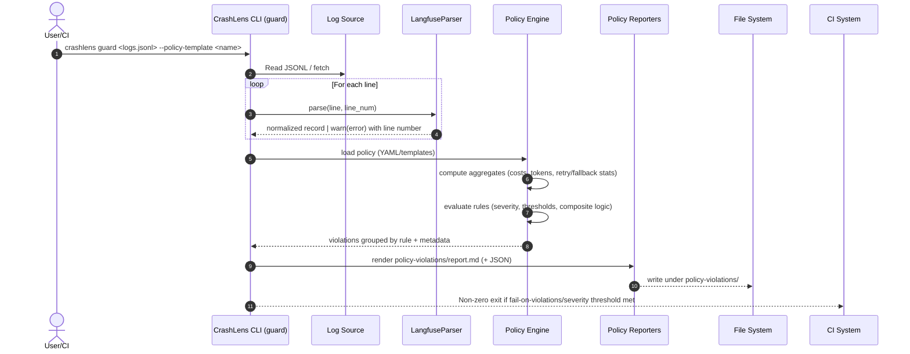

# CrashLens Architecture & Execution Flow

This document shows end-to-end flows for the Scan and guard commands, including parsing, detector pipeline, retry/fallback handling, policy evaluation, reporting, Slack integration, and CI behavior.

- Normalization: Convert raw logs → canonical fields (traceId, model, tokens, cost, timestamps, metadata)
- Detectors: Identify waste patterns (retry loops, fallback storms, overkill models, fallback failures) with suppression and priorities
- Policy Engine: Evaluate YAML rules against canonical fields and detector metrics
- Reporters: Render Slack/Markdown/JSON (plus detailed JSON traces when requested)

---

## 1) Scan command (end-to-end)

```mermaid
sequenceDiagram
    autonumber
    actor U as User
    participant CLI as CrashLens CLI (scan)
    participant SRC as Log Source (file/clipboard/API)
    participant PARSER as LangfuseParser
    participant DET as Detector Pipeline
    participant REP as Reporters
    participant FS as File System
    participant SLACK as Slack Webhook (optional)

    U->>CLI: crashlens scan <logs.jsonl> --format slack --summary [--detailed]
    CLI->>SRC: Read JSONL or fetch via API (Langfuse/Helicone)
    loop For each line
        CLI->>PARSER: parse(line, line_num)
        PARSER-->>CLI: normalized record | warn(error) with line number
    end
    CLI->>DET: run(detectors, thresholds)
    note over DET: Group by traceId/model/prompt; sort by timestamp
    DET->>DET: RetryLoop: count calls; waste = calls beyond max_retries
    DET->>DET: FallbackStorm: detect cascades within time window
    DET->>DET: OverkillModel: model vs. task suitability
    note over DET: Suppression: higher-priority detector claims a trace; lower ones skip to avoid double-counting
    DET-->>CLI: detections + costs + suppression map
    CLI->>REP: format(detections, traces, summary_only?)
    REP-->>FS: write report.md (Slack/MD/JSON) + detailed_output/ (optional)
    alt --format slack
        CLI->>SLACK: POST Slack blocks (via `crashlens slack notify`)
    end
    CLI-->>U: Exit code 0
```

Key notes
- Retry handling: only excess calls beyond `max_retries` are counted as waste/savings
- Fallback handling: storms detected over a window; suppression prevents double-counting with retry loops
- Privacy: summary-only mode suppresses trace IDs; PII scrubber can redact content

---

## 2) guard command (end-to-end)



Key notes
- The engine can use detector outputs and canonical fields for rule evaluation
- Violations are attributed once (suppression), to the most relevant root cause
- CI pipelines can fail builds based on severity/thresholds; artifacts are uploaded for review

---

## Canonical data contract (normalized record)
- Required: traceId, timestamps (startTime/endTime or timestamp), model, level/name
- Usage: usage.prompt_tokens, usage.completion_tokens (or aggregated tokens)
- Optional: cost (if present), metadata.*
- Malformed JSONL lines: logged with exact `line_num` and skipped unless `--fail-fast`

---

## Outputs
- scan
  - report.md (Slack/MD/JSON)
  - detailed_output/trace-*.json (optional)
- guard
  - policy-violations/report.md (+ JSON)
  - Exit codes for CI gating

---

## Extension points
- Parsers: adapters mapping new sources → canonical schema (+ golden samples/tests)
- Detectors: add heuristics; respect suppression/priority
- Reporters/Sinks: Slack blocks templating; additional sinks (e.g., OTEL/email)
- Policy: composite rules (AND/OR/THRESHOLD), severity, actions (dry-run/alert/exit)

---

## Roadmap highlights
- Multiprocess/streaming ingestion for large files; chunked detection
- Safe expression support for richer policy logic
- Pluggable sinks and customizable Slack blocks
